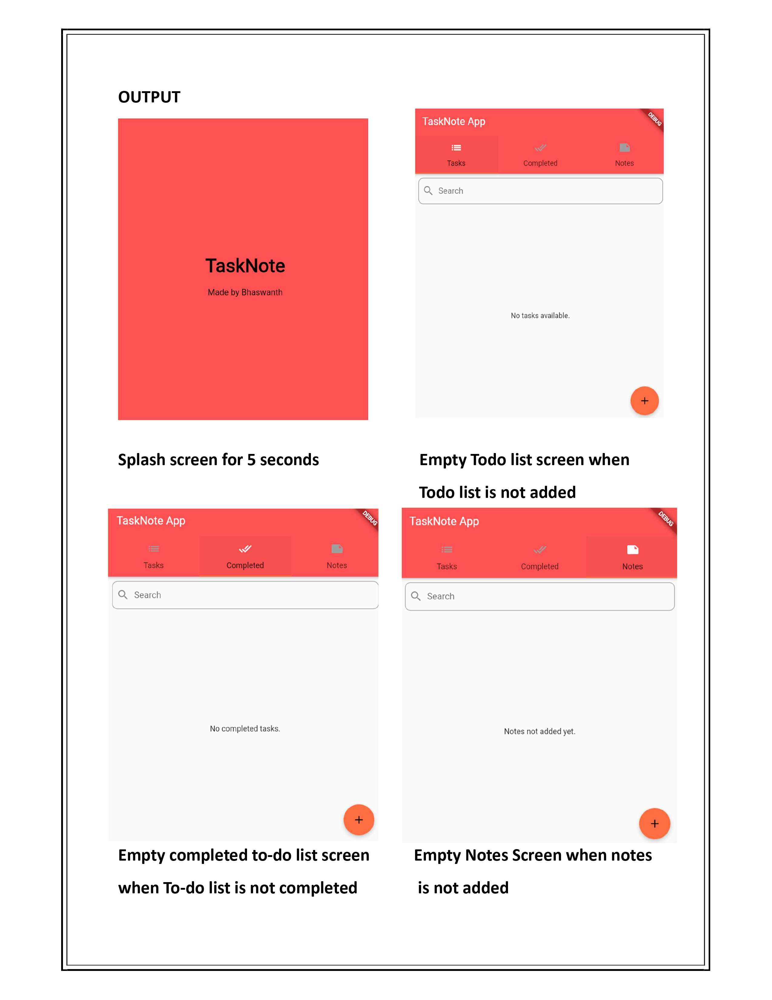
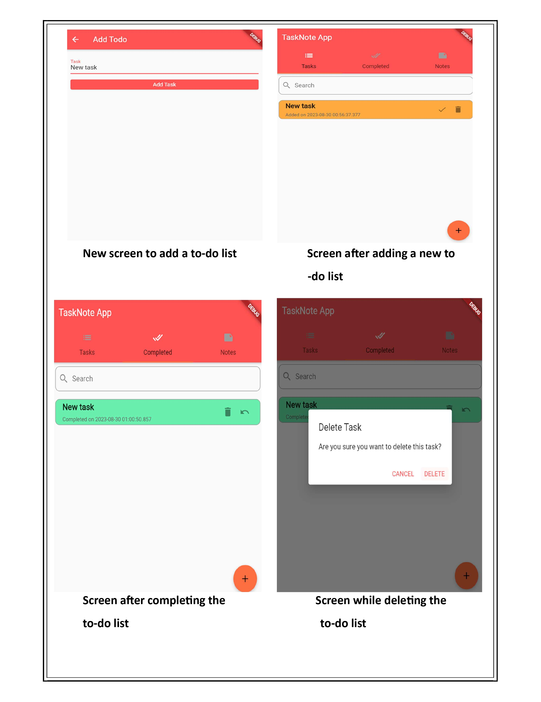

# TaskNote App

A mobile application developed with Flutter and Dart, designed to help users manage and organize their tasks efficiently. TaskNote provides a seamless experience for creating, viewing, editing, and deleting tasks, all within a well-designed interface.

## Table of Contents

- [Features](#features)
- [Technologies Used](#technologies-used)
- [Getting Started](#getting-started)
- [Usage](#usage)
- [Project Structure](#project-structure)
- [Components](#components)
- [Screenshots](#screenshots)
- [Contribution](#contribution)

## Features

- **Create Tasks:** Add new tasks with a title, description, and due date.
- **View Tasks:** Display tasks in a list view with sorting and filtering options.
- **Edit Tasks:** Modify existing tasks to update details or change statuses.
- **Delete Tasks:** Remove tasks that are no longer needed.
- **Splash Screen:** A welcome screen displayed on app launch.

## Technologies Used

- **Flutter:** A UI toolkit for building natively compiled applications for mobile, web, and desktop from a single codebase.
- **Dart:** The programming language used with Flutter to build the app's logic and functionality.

## Getting Started

### Prerequisites

- Flutter SDK (v3.0.0 or later)
- Dart SDK (v2.18.0 or later)
- An IDE like Visual Studio Code or Android Studio with Flutter and Dart plugins installed

### Installation

1. **Clone the repository:**

    ```sh
    git clone https://github.com/Bhaswanth67/tasknote-app.git
    cd tasknote-app
    ```

2. **Install dependencies:**

    ```sh
    flutter pub get
    ```

3. **Run the app:**

    ```sh
    flutter run
    ```

4. **Open the app on your emulator or physical device.**

## Usage

1. **Create a Task:** Tap the "Add Task" button, enter the task details, and save.
2. **View Tasks:** Browse through your tasks on the main screen. Use the filter and sort options to organize them.
3. **Edit a Task:** Tap on a task to edit its details and save the changes.
4. **Delete a Task:** Swipe left on a task in the list to delete it.
5. **Splash Screen:** The app starts with a splash screen before navigating to the main task list.

## Project Structure
 
### Components

- **main.dart:** Entry point of the application that sets up the app and routes.
- **add_todo_screen.dart:** Screen for adding a new task.
- **splash_screen.dart:** Displays a splash screen on app launch.
- **todo_app.dart:** Contains the main logic and setup for the task management application.
- **todo_list_screen.dart:** Displays the list of tasks and handles user interactions.

## Screenshots
 
 
 
## Contribution

If you have suggestions or improvements, please fork the repository and submit a pull request. For major changes, please open an issue to discuss what you would like to change.

Thank you for using the TaskNote app!
